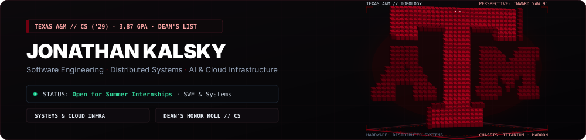
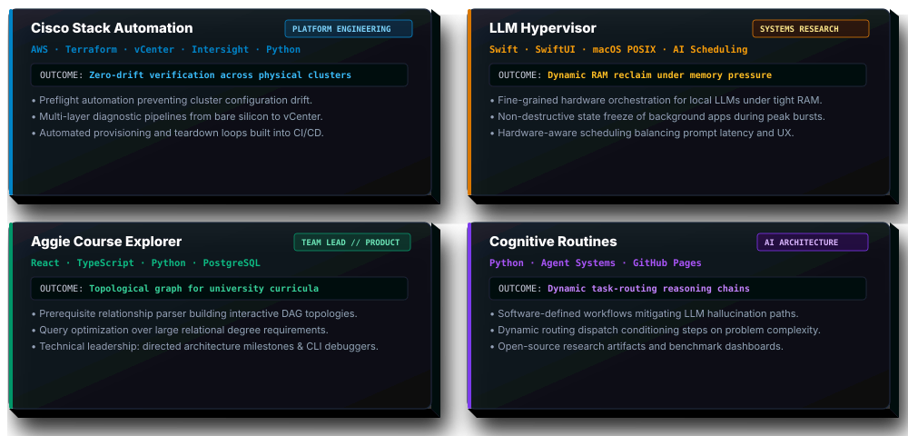
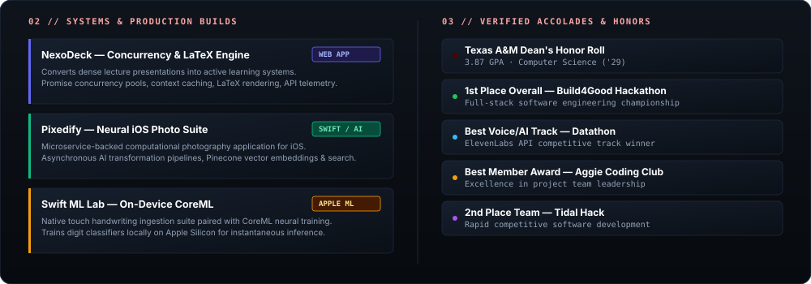

<!-- ================= 01 // 3D HIGH-CONTRAST VOXEL MATRIX HERO ================= -->

 

<!-- ================= 02 // ARCHITECTURE & RESEARCH SYSTEMS (2x2) ================= -->

  

<!-- ================= 03 // TECHNICAL FOCUS & CORE ECOSYSTEM ================= -->

| Software Systems | Systems & Compute | Infrastructure |
| :--- | :--- | :--- |
| **Backend services, APIs, concurrency, data flows** | **Local LLM workloads, resource scheduling, macOS POSIX** | **AWS, Terraform, VMware vCenter, Cisco Intersight** |
| React · TypeScript · Python · Swift · PostgreSQL | CPU & memory reallocation, local inference | Provisioning, validation, CI/CD pipelines |

 

<!-- ================= 04 // PRODUCTION BUILDS & VERIFIED HONORS ================= -->

 

<!-- ================= 05 // LANGUAGES ================= -->
<table width="100%">
<tr>
<td width="55%" valign="top">

#### Programming
`C++` · `Python` · `Java` · `TypeScript` · `JavaScript` · `Swift` · `Shell` · `LaTeX` · `R` · `Haskell`

</td>
<td width="45%" valign="top">

#### Spoken
`English (Native)` · `Hebrew (Native)` · `Mandarin Chinese (~HSK2)`

</td>
</tr>
</table>

 

<!-- ================= 06 // EXECUTIVE DOSSIER ACTIONS ================= -->

  
  &nbsp;&nbsp;
  
  &nbsp;&nbsp;
  
  &nbsp;&nbsp;
  
  &nbsp;&nbsp;
  

 

<!-- Framed Resume Snapshot -->

  

Curriculum Vitae Snapshot · Texas A&M University Computer Science '29

